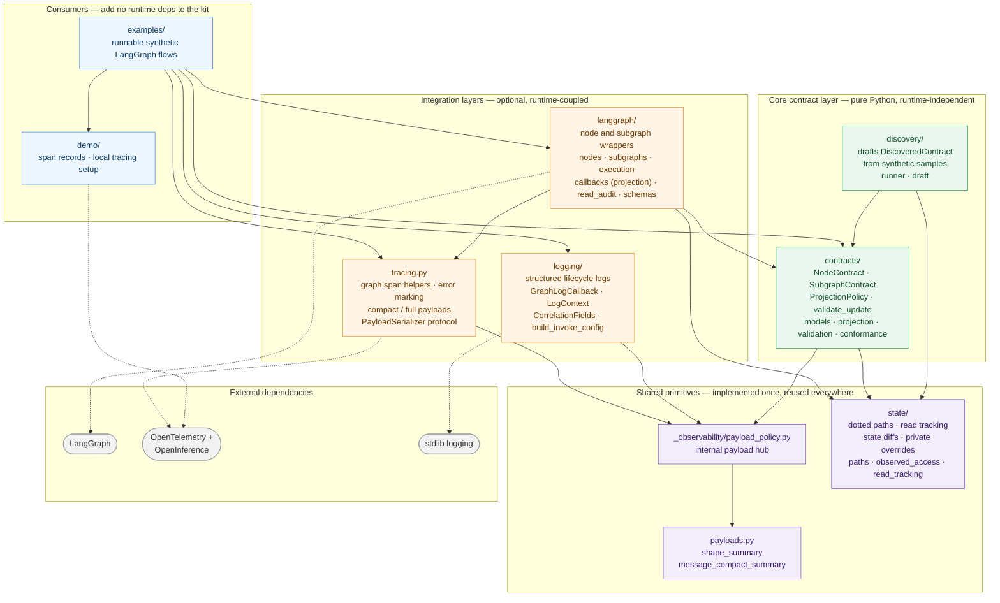

# Architecture

graphobs is organized as a small public Python library with source under `src/graphobs`.

## Component & Dependency Map

The diagram below shows the key components grouped by layer. **Solid arrows** point
from a component to the internal component it depends on; **dashed arrows** point to
external libraries. Dependencies flow strictly downward — the core contract layer and
shared primitives never import the integration layers above them.



Two reuse spines hold the kit together. Payload shaping lives in `payloads.py`
(the leaf primitive) and is applied through the internal `_observability/payload_policy.py`
hub, which contracts, tracing, and logging all import — so compact-by-default
serialization is defined exactly once. State-path handling lives in `state/` and is
reused by contracts, discovery, and the LangGraph integration.

## Final Package Shape

```text
src/graphobs/
  __init__.py
  _version.py
  payloads.py
  tracing.py
  py.typed
  contracts/
    __init__.py
    conformance.py
    models.py
    projection.py
    validation.py
  state/
    __init__.py
    observed_access.py
    paths.py
    read_tracking.py
  langgraph/
    __init__.py
    callbacks.py
    execution.py
    nodes.py
    read_audit.py
    schemas.py
    subgraphs.py
  _observability/
    __init__.py
    payload_policy.py
  logging/
    __init__.py
    callback.py
    context.py
    invoke_config.py
    lifecycle.py
  discovery/
    __init__.py
    draft.py
    runner.py
  demo/
    __init__.py
    span_records.py
    tracing_setup.py
tests/
examples/
docs/
```

## Current Layer

The core contract layer is plain Python and independent of graph runtimes,
telemetry exporters, or validation frameworks. It provides:

- `NodeContract` for public and private node state boundaries.
- `SubgraphContract` for parent/subgraph state boundaries.
- `ProjectionPolicy` for dotted-path include rules.
- Validation helpers that reject undeclared writes without storing state values
  in error objects.
- Experimental discovery helpers that draft node contracts from synthetic
  sample states.

The tracing layer depends on OpenTelemetry and OpenInference semantic
conventions. It provides:

- Context-manager helpers for graph spans.
- Compact-by-default input and output payload serialization.
- Explicit full payload mode for controlled debugging data.
- Flat searchable span attributes.
- Error marking helpers for failed spans.

The LangGraph integration layer depends on LangGraph and composes the contract
and tracing layers. It provides wrappers for nodes and compiled subgraphs while
keeping exporter setup and graph business logic outside the package.

The callback projection layer uses the contract model to curate matched
LangGraph node callback payloads before they reach downstream handlers. It does
not install callbacks automatically, and root graph events without node
metadata pass through unchanged.

The logging layer uses the Python standard logging module and a
LangChain/LangGraph-compatible callback shape. It provides:

- `LogContext` for run correlation identifiers.
- `CorrelationFields` for configurable metadata field names.
- `GraphLogCallback` for start, end, and error lifecycle events.
- `build_invoke_config` for attaching correlation metadata and callbacks to a
  graph invocation.

Log events contain correlation fields, durations, run identifiers, and compact
input/output shape summaries. They do not configure exporters or store full
state payloads.

Compact shape summaries are implemented once in the public `payloads` module and
reused by contracts, callback projection fallbacks, structured logs, and
tracing. The tracing `PayloadSerializer` protocol is the customization point for
applications that need additional redaction rules before payloads are
serialized.

Dotted state path operations, observed read classification, private override
splitting, and state diffs are implemented once in the `state` package and
reused by contracts, discovery, and LangGraph integration code. The package root
exposes a short headline interface; lower-level primitives remain available
from their concrete implementation modules.

The discovery module is runtime-independent. It runs sync or async node
functions against synthetic samples, records observed mapping reads and returned
update writes, and returns a draft `DiscoveredContract` for review. Discovery is
sample-dependent and best-effort, so it does not replace manual contract design.

## Intended Layers

The example layer contains runnable, synthetic LangGraph flows under
`examples/`. These examples exercise the public API without adding runtime
dependencies or configuring hosted observability services.

## Dependency Direction

Core contract models should stay independent of graph runtimes and
observability exporters. Optional integration layers may depend on graph or
telemetry libraries, but core projection and validation should remain importable
on their own. The tracing layer may emit spans through OpenTelemetry, but it
must not configure exporters or require a specific backend. The logging layer
uses stdlib logging and must not require a specific log backend. Callback
projection wraps user-provided callback handlers without changing exporter or
backend configuration.
